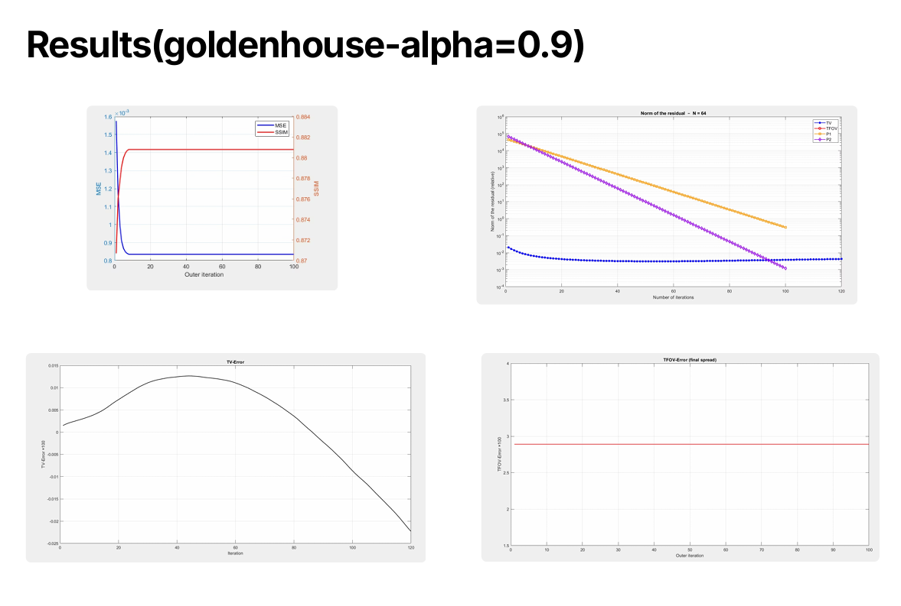
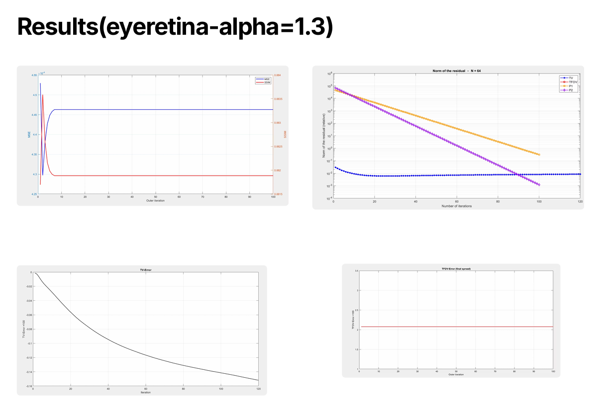
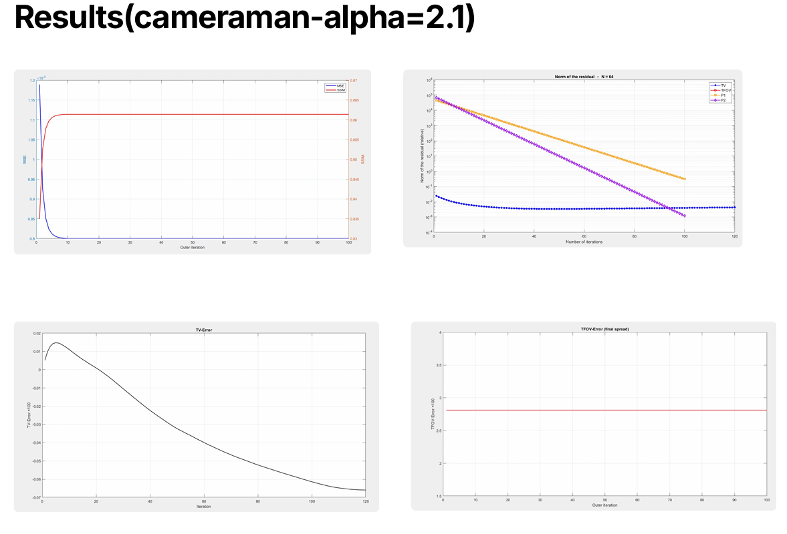
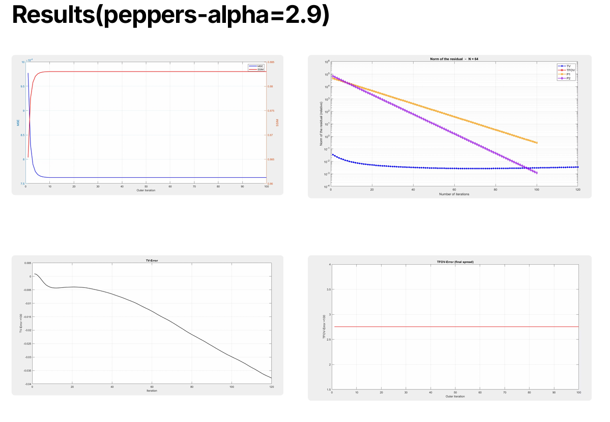

# Preconditioning Technique for an Image Deblurring Problem using TFOV Model

## Course
**22MAT230 – Mathematics for Computing IV**

---

# 1. Team Members

| S.No | Name | Roll Number |
|-----|------|-------------|
| 1 | Deepika Reddy | CB.SC.U4AIE24215 |
| 2 | Jithin Reddy | CB.SC.U4AIE24230 |
| 3 | Police Aryan | CB.SC.U4AIE24241 |
| 4 | Praveen Reddy | CB.SC.U4AIE24243 |

---

# 2. Base / Reference Paper

**Al-Mahdi, A.M. (2023)**  
*Preconditioning Technique for an Image Deblurring Problem with the Total Fractional-Order Variation Model.*

Journal: Mathematical and Computational Applications  
Volume 28, Issue 5, Article 97

DOI  
https://doi.org/10.3390/mca28050097

Full Paper  
https://www.mdpi.com/2297-8747/28/5/97/htm

---

# 3. Project Outline

Image deblurring is an **ill-posed inverse problem** where we recover the original sharp image $u$ from a blurred observation.

$$
z = Ku + \varepsilon
$$

Where:

- $K$ = blur operator  
- $u$ = original image  
- $z$ = observed blurred image  
- $\varepsilon$ = noise  

---

# 4. Key Mathematical Concepts

---

## 4.1 Condition Number

The condition number measures the numerical stability of a matrix.

$$
\kappa_2(A) = \frac{\sigma_{\max}(A)}{\sigma_{\min}(A)}
$$

Where:

- $\sigma_{\max}$ = largest singular value  
- $\sigma_{\min}$ = smallest singular value  

If

$$
\kappa(A) \gg 1
$$

then the system is **ill-conditioned**.

---

# 4.2 Ill-Conditioned Saddle-Point System

After discretization the optimization problem becomes

$$
\begin{bmatrix}
I_n & K_h \\
-K_h^* & \lambda L_h^{\alpha}(U_h)
\end{bmatrix}
\begin{bmatrix}
V_h \\
U_h
\end{bmatrix}
=
\begin{bmatrix}
Z_h \\
0
\end{bmatrix}
$$

System size:

$$
2n \times 2n
$$

where

$$
n = N^2
$$

---

## Schur Complement

$$
S = K_h^* K_h + \lambda L_h^{\alpha}(U_h)
$$

This matrix becomes **extremely ill-conditioned**.

---

# 4.3 Preconditioning

To improve convergence we use **block triangular preconditioners**.

---

## Preconditioner $P_1$

$$
P_1 =
\begin{bmatrix}
I_n & K_h \\
0 & -(I + \lambda L_{TV})
\end{bmatrix}
$$

---

## Preconditioner $P_2$

$$
P_2 =
\begin{bmatrix}
I_n & K_h \\
0 & -(C^* C + \lambda L_{TV})
\end{bmatrix}
$$

Where:

- $C$ is a **circulant approximation** of $K_h$.

Circulant matrices allow **FFT-based fast inversion**.

---

# Solver Strategy

The algorithm combines:

- **FGMRES** (outer solver)
- **PCG** (inner solver)
- **Fixed-Point Iteration**

Iteration equation:

$$
(K^T K + \lambda L_h^{\alpha}(U^{(m)}))U^{(m+1)} = K^T z
$$

for

$$
m = 0,1,2,\dots
$$

---

# 4.4 Total Variation (TV) Model

$$
\min_{u}
\left(
\frac{1}{2}\|Ku - z\|_2^2
+
\lambda
\int_{\Omega} |\nabla u|\,dx
\right)
$$

TV preserves edges but introduces **staircase artifacts**.

---

# 4.5 Total Fractional-Order Variation (TFOV) Model

$$
\min_{u}
\left(
\frac{1}{2}\|Ku - z\|_2^2
+
\lambda
\int_{\Omega}
\sqrt{|\nabla^{\alpha} u|^2 + \beta^2}\,dx
\right)
$$

Where:

- $\alpha$ = fractional order  
- $\beta$ = small regularization parameter  

---

## Fractional Divergence

$$
\mathrm{div}^{\alpha} \phi =
\frac{\partial^{\alpha}\phi_1}{\partial x^{\alpha}}
+
\frac{\partial^{\alpha}\phi_2}{\partial y^{\alpha}}
$$

---

# Advantages of TFOV

- Reduces staircase artifacts  
- Preserves textures  
- Provides non-local smoothing  
- Higher PSNR for $\alpha > 1$

---

# 5. Experimental Results

## Result Image 1

---

## Result Image 2

---

## Result Image 3

---

## Result Image 4

---

# 6. Conclusion

This project studied **preconditioning techniques for image deblurring using the TFOV model**.

Key observations:

- TFOV reduces staircase artifacts compared to classical TV
- Block triangular preconditioners improve convergence
- FGMRES + PCG efficiently solve large saddle-point systems
- Fractional models preserve textures better

Thus TFOV combined with preconditioning provides an effective method for **high-quality image restoration**.

---

# 7. References

1. Al-Mahdi, A.M. (2023).  
   *Preconditioning Technique for an Image Deblurring Problem with the Total Fractional-Order Variation Model.*

2. Mathematical and Computational Applications, 28(5), 97.

3. https://doi.org/10.3390/mca28050097
